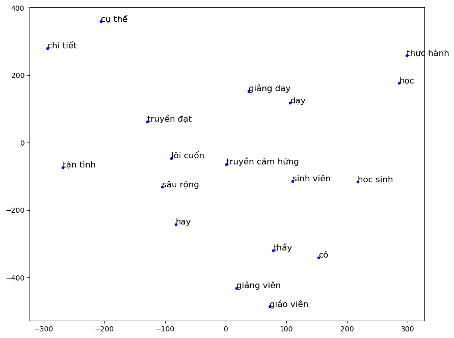
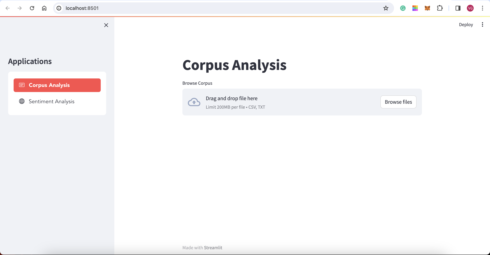
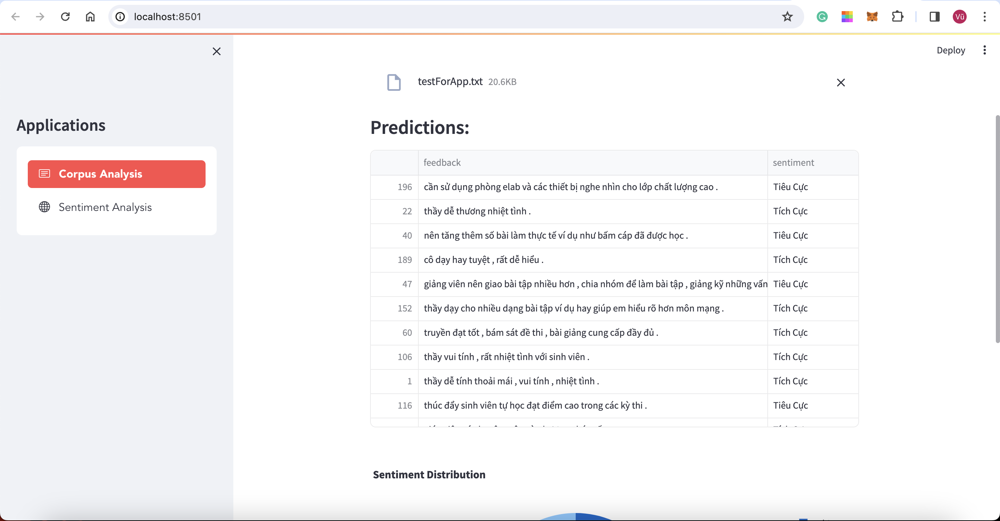
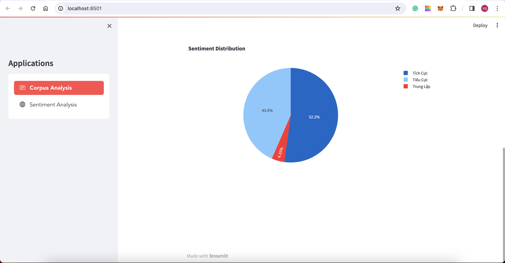
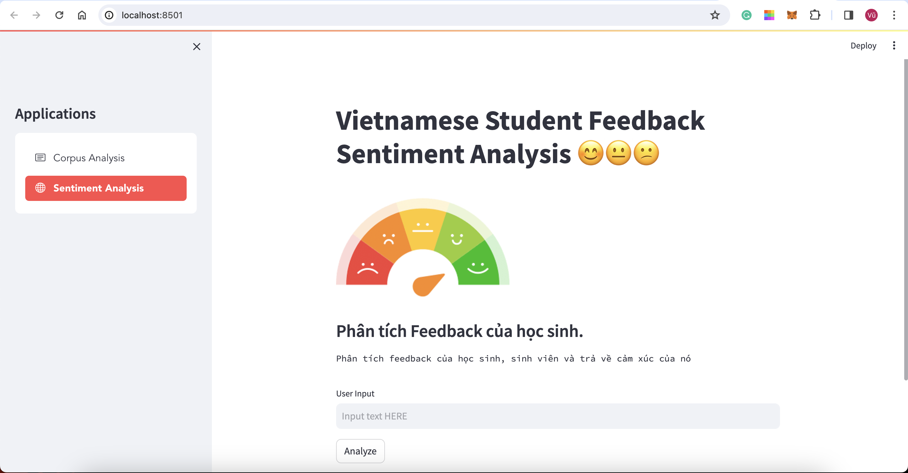
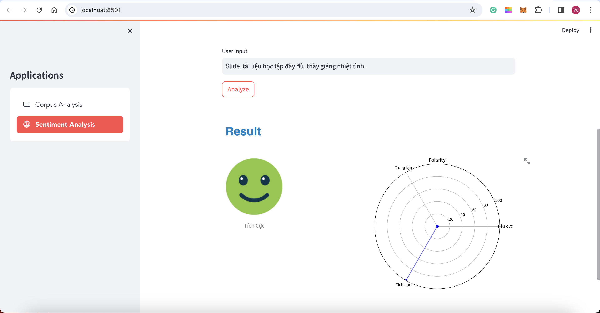

# Vietnamese Student Feedback Sentiment Analysis Project
---
In this Project, I have used the Corpus named Vietnamese Student Feedback Corpus, which belongs to The UIT NLP Group and has more than 16,000 pieces of feedback from Vietnamese students, to solve the Sentiment Analysis task. I have trained some models and chose the best model with the result in the following table.\
**Note**: You can download the corpora in https://nlp.uit.edu.vn/

## Model used:
|Model|Feature|Precision|Recall|F1-Score|Accuracy|
|---|---|---|---|---|---|
|LSTM| Word2Vec|90.0|89.7|89.8|89.7|

### Word2Vec
<p align = "center">
    
</p>

---
## Web Application
We have built a web application for Analyzing the Sentiment of Vietnamese Student's Feedback

### Corpus Analysis
You can browse the corpus which contains feedback like 4 corpora in the [**Data/testForApp**](Data/testForApp) directory. The application will predict the sentiment for each feedback, and then display the data frame of the result and the chart for analysis.
<p align = "center">
    
</p>

<p align = "center">
    
</p>

<p align = "center">
    
</p>

### Feedback's Sentiment Analysis
You can input Vietnamese feedback about schools and universities including lecturers, facilities, curriculum, etc, the application will predict the sentiment and display the polarity beside.
<p align = "center">
    
</p>

<p align = "center">
    
</p>

---
## How to use?
#### Clone the project
```bash
git clone https://github.com/VuBacktracking/Vietnamese-Student-Feedback-Sentiment-Analysis.git
```
#### Install required packages

```bash
pip install -r requirements.txt
```

#### Generate model (optional)
We already ran and saved the model `lstm_model.h5` in `models` directory

```bash
#run this file to generate the models
lstm_create_model.ipynb
```
```bash
#run this file to check the result of model
lstm_result.ipynb
```

#### Now run
``` bash
streamlit run app.py
```
___
## Future Work
